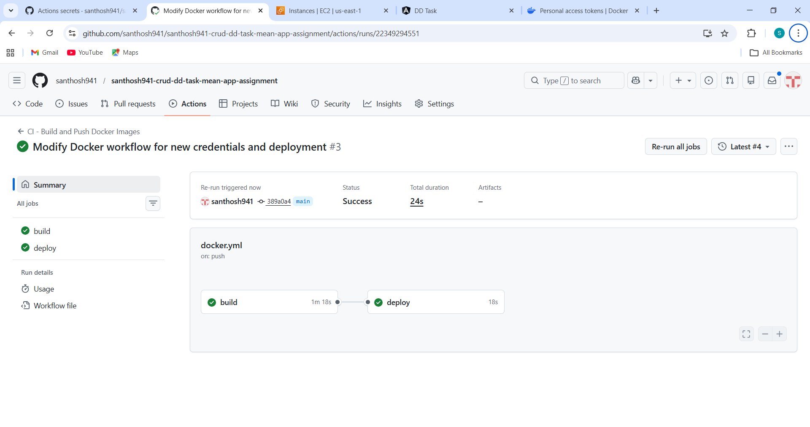
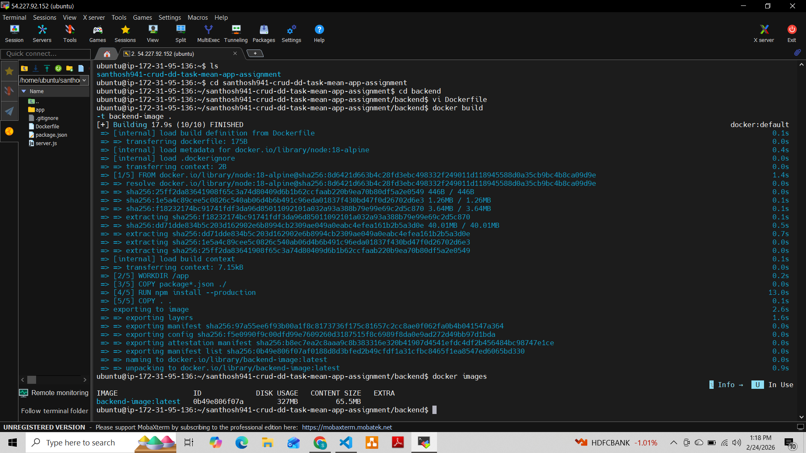
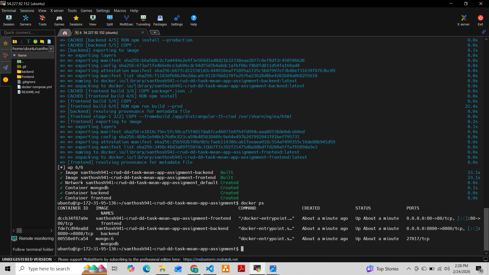
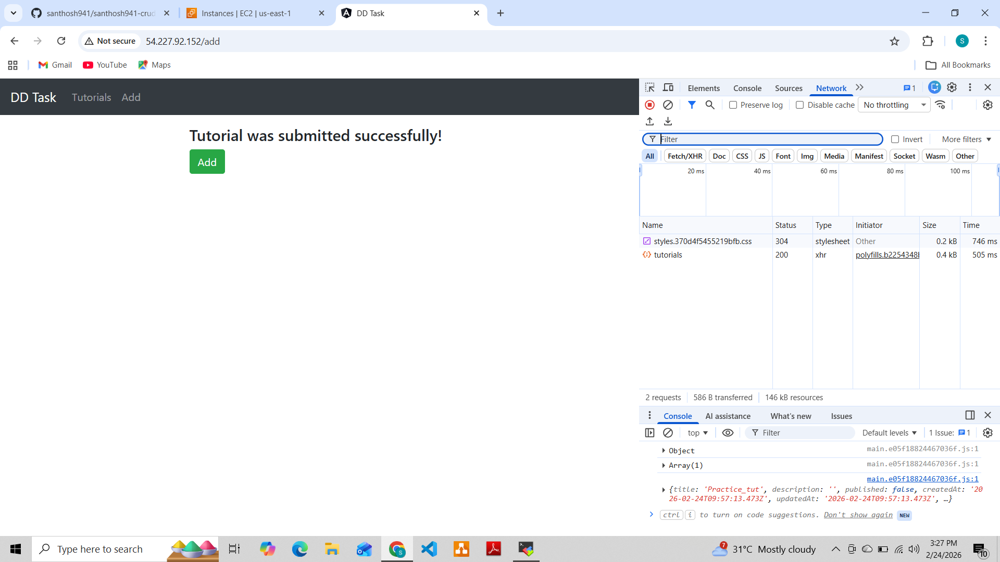

Full Stack MEAN Application – DevOps Assignment
📌 Project Overview

This project demonstrates the containerization, CI/CD automation, and deployment of a full-stack MEAN (MongoDB, Express, Angular, Node.js) application using modern DevOps practices.

The application supports CRUD operations for managing tutorials and is fully deployed using Docker and automated via GitHub Actions CI/CD pipeline on AWS EC2.

🏗️ Architecture Overview
Flow:

User → Nginx (Port 80) →

/ → Angular Frontend

/api → Node.js Backend

Backend → MongoDB

The application is accessible publicly via EC2 on Port 80.

🛠️ Technologies Used

Angular

Node.js

Express

MongoDB

Docker

Docker Compose

GitHub Actions

AWS EC2 (Ubuntu)

Nginx Reverse Proxy

📁 Repository Structure
.
├── backend/
│   ├── Dockerfile
│   ├── package.json
│   └── ...
│
├── frontend/
│   ├── Dockerfile
│   ├── nginx.conf
│   └── ...
│
├── docker-compose.yml
├── README.md
├── docs/
│   ├── github-actions-success.png
│   ├── dockerhub-images.png
│   ├── ec2-containers.png
│   ├── application-ui.png
│
└── .github/
    └── workflows/
        └── docker.yml

        
🐳 Docker Configuration
Backend

Built using Node base image

Exposes port 8080

Connects to MongoDB container

Frontend

Angular app built inside container

Served using Nginx

Reverse proxy configured for /api

Docker Compose Services

mongodb

backend

frontend (nginx reverse proxy)

To run locally:

docker compose up --build

Access via:

🌐 Nginx Reverse Proxy

Configured inside:

frontend/nginx.conf

Proxy configuration:

location /api/ {
    proxy_pass http://backend:8080;
}

This ensures:

Angular frontend served at /

Backend APIs routed via /api

Entire app accessible on Port 80

☁️ EC2 Deployment
Steps Performed:

Created Ubuntu EC2 instance

Installed Docker & Docker Compose

Cloned repository

Deployed using:

docker compose up -d

Application accessible at:

http://44.207.177.53 

🔄 CI/CD Pipeline – GitHub Actions

Workflow file:

.github/workflows/docker.yml
Trigger

Push to main branch

CI Process

Checkout repository

Login to DockerHub

Build backend image

Push backend image

Build frontend image

Push frontend image

CD Process

SSH into EC2

Pull latest Docker images

Stop running containers

Restart containers using docker compose

🔐 GitHub Secrets Used

DOCKERHUB_USERNAME

DOCKERHUB_TOKEN

EC2_HOST

EC2_USER

EC2_SSH_KEY

All sensitive credentials are securely stored as GitHub repository secrets.

📸 Screenshots

✅ GitHub Actions Successful Run

✅ DockerHub repo

✅ DockerHub Images

✅ Running Containers in EC2

✅ Application Running in Browser

🧪 How to Run the Application
Using Docker Compose
docker compose up -d

Access Application
static ip : http://44.207.177.53 

✅ Assignment Completion Checklist

✔ Repository Setup

✔ Backend Dockerfile

✔ Frontend Dockerfile

✔ MongoDB Setup

✔ Docker Compose Configuration

✔ EC2 Deployment

✔ GitHub Actions CI/CD

✔ Automated Docker Image Push

✔ Automated EC2 Deployment

✔ Nginx Reverse Proxy

✔ Documentation & Screenshots

🎯 Conclusion

This project demonstrates a complete DevOps workflow including:

Containerization

Image management

CI automation

CD automation

Infrastructure deployment

Reverse proxy configuration

The full-stack MEAN application is successfully deployed with automated CI/CD pipeline using GitHub Actions and Docker on AWS EC2.
